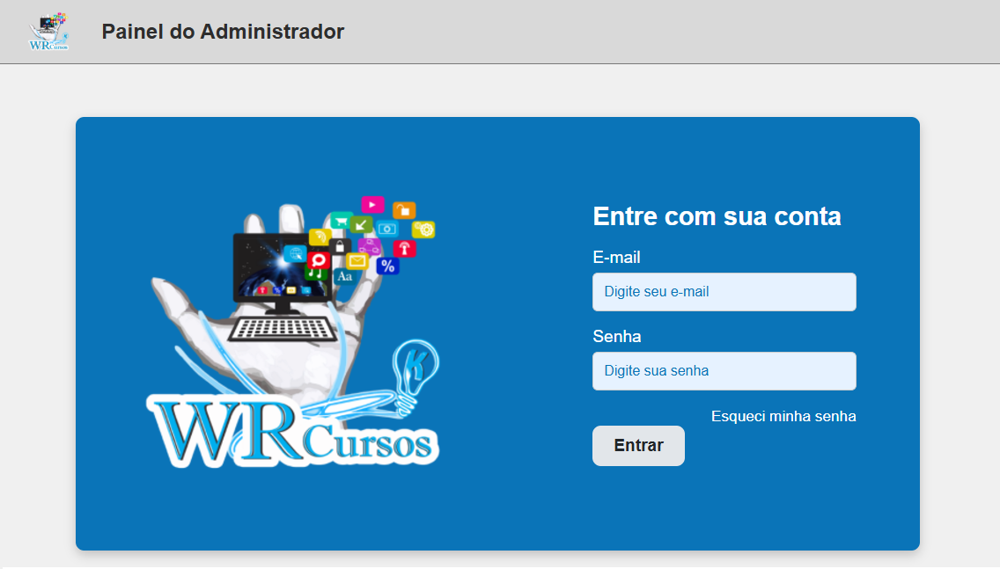

# WR Cursos - Painel Administrativo


## Descrição

**WR Cursos** é um Painel Administrativo que permite o cadastro de `cursos` para serem vendidos no site da empresa [WR Cursos Profissionalizantes](https://www.instagram.com/wrcursosdf/).



## Como instalar?

### Pré-requisitos
1. Node.js 14+ instalado: [https://nodejs.org/en](https://nodejs.org/en)
2. Servidor do **MySQL** instalado: [XAMPP](https://www.apachefriends.org/pt_br/index.html)

### Passos
1. Importar o arquivo do banco de dados `schema-creation-script.sql` no cliente MySQL

    1.1. Por exemplo: [MySQL Workbench](https://dev.mysql.com/downloads/workbench/)

2. Abrir a pasta `api/` e executar os comandos:
```markdown
npm install <!-- Espere o NPM instalar todas as dependências do projeto -->
npm start
```

3. Abrir a pasta `web/` e executar os comandos:
```markdown
npm install <!-- Espere o NPM instalar todas as dependências do projeto -->
npm start
```

#### Observações
Em caso de **erro** ao tentar executar a aplicação, verificar se algum outro programa já está executando na porta `8080`

Por exemplo, no Windows você consegue parar o programa através do número do processo (pid). Para isso, basta executar o seguinte comando para obter o pid:
```markdown
netstat -ano | find "8080"
```
E então você pode parar o programa com o seguinte comando: 
```markdown
taskkill /pid {pid} /f
<!-- Exemplo: taskkill /pid 23136 /f -->
```

## Como testar?
Você pode acessar o painel administrativo com as credenciais de administrador:
```
e-mail: admin@wrcursos.com.br
senha: admin123
```

## Contribuição
Contribuições são bem-vindas! Se você tiver qualquer correção ou sugestões de melhorias, por favor, abra uma issue ou envie um pedido de pull request no repositório.

Ao contribuir com este projeto, por favor, mantenha o estilo de escrita dos códigos e envie as mudanças em um branch separado.

**E-mail:** [douglaslima-pro@outlook.com](mailto:douglaslima-pro@outlook.com)
